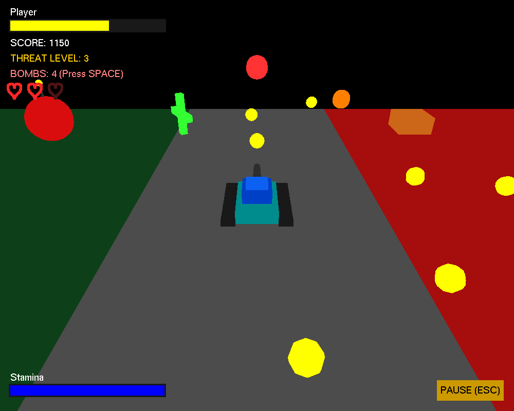
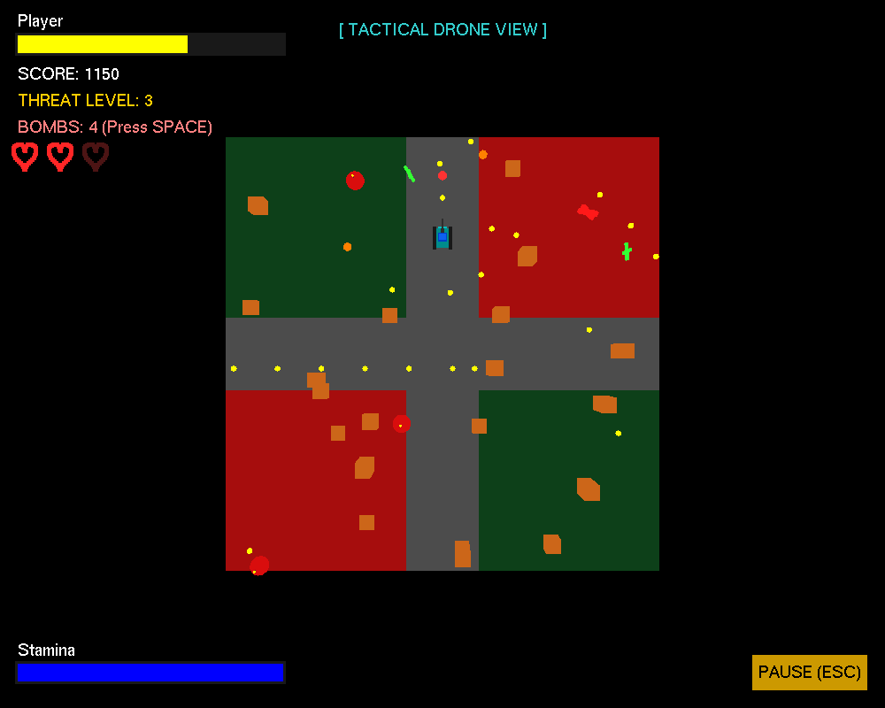
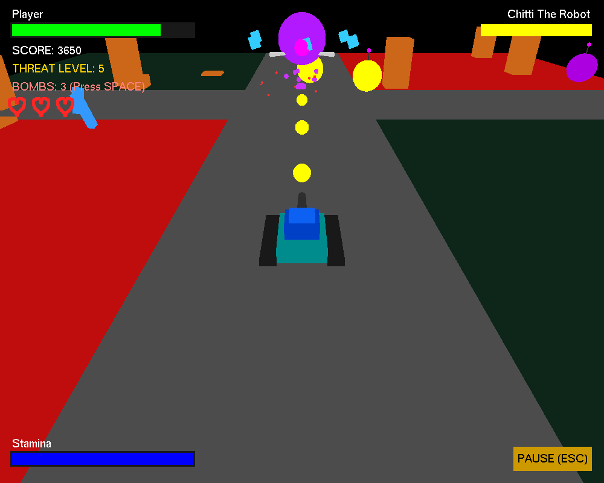

# System Defender

A 3D survival shooter written in Python with PyOpenGL. You drive an antivirus tank across a corrupted motherboard and clear out waves of malware bugs, then take on two bosses.

It was built as a team project for **CSE423: Computer Graphics** (Spring 2026). There's no game engine, textures or asset files. Every model is put together at runtime from GLUT/GLU primitives (cubes, spheres, cylinders) using hierarchical transforms, and the HUD is drawn with an orthographic overlay.



| Tactical drone view | Final boss: Chitti |
| :---: | :---: |
|  |  |

## Features

### Graphics techniques

- **Hierarchical modeling.** The tank's hull, tracks and turret are one matrix-stack hierarchy, so the turret aims independently of the base (`glPushMatrix` / `glPopMatrix`). Enemies (body, antenna, six legs) and bosses (orbiting cubes, legs) are built the same way.
- **Two cameras.** A perspective chase camera sits behind the tank (`gluLookAt`). Press `V` for a top-down tactical drone view of the whole arena.
- **Projectile physics.** Bullets glance off firewalls and ricochet off the arena walls (three wall bounces before they fizzle). Bombs fly along a parabolic arc under gravity and do area damage where they land.
- **Particle explosions.** Destroyed enemies throw out debris that falls under gravity, bounces off the floor and shrinks over its lifetime.
- **Animated environment.** Firewall pillars rise and sink on sine waves. Power-ups and zone pickups spin and hover.
- **2D HUD overlay.** Health and boss bars go from green to yellow and flash red when low. There's also a stamina bar, and the lives display uses hearts plotted from a parametric curve.

### Gameplay

- **Five threat levels** unlock by score (0 / 400 / 1000 / 2000 / 3500). Enemies spawn and move faster at each level, and the floor colors shift.
- **Adaptive enemy AI.** Bugs home in on the tank. From level 4 they add sine-wave evasive strafing.
- **Boss 1: Pegasus (level 4).** Shrinks as it takes damage, speeds up when hurt and splits into four shielded minions when it dies.
- **Boss 2: Chitti (level 5).** Lobs bombs at you and summons minions. Beating it wins the game.
- **Floor quadrants.** Red *corrupted* quadrants halve your speed. Green *secure* quadrants slowly restore health.
- **Pickups.** Heal cubes (+30 HP) and bomb orbs (+2 bombs) drop at random. Floating zone tokens give health (green cross), refill stamina (blue bolt) or slow you down (red X).
- **Sprint and lives.** Toggle sprint to trade stamina for double speed. Stamina recovers while sprint is off. You get 3 lives, with a short invincibility window after each respawn.

## Controls

| Key | Action |
| --- | --- |
| `W` / `S` | Move forward / backward |
| `A` / `D` | Rotate tank base |
| `←` / `→` | Rotate turret |
| Left click / `Enter` | Fire bullet |
| Right click / `Space` | Launch bomb |
| `E` | Toggle sprint (uses stamina) |
| `V` | Toggle drone camera |
| `Esc` | Pause / resume |
| `R` | Restart |

## Getting started

You need Python 3 and PyOpenGL. It's tested with Python 3.14 and PyOpenGL 3.1.10.

```bash
git clone https://github.com/sandipkumarpaul/system-defender-cg.git
cd system-defender-cg
pip install -r requirements.txt
python system-defender-cg.py
```

- **Windows:** the PyOpenGL wheel includes freeglut, so nothing else is needed.
- **Linux:** install freeglut too, e.g. `sudo apt install freeglut3-dev` on Debian/Ubuntu.
- If you see `NullFunctionError: Attempt to call an undefined function glutInit`, PyOpenGL can't find a GLUT library. Install freeglut for your platform.

## Project structure

```
system-defender-cg/
├── system-defender-cg.py   # the whole game
├── requirements.txt
└── assets/                 # screenshots used in this README
```

The game is a single script, split into sections:

| Section | What it does |
| --- | --- |
| Global state | `new_game_state()` builds the shared `game` dictionary, used both at launch and on restart |
| Drawing functions | Tank, enemies, bosses, firewalls, projectiles, particles, pickups |
| Physics & logic | Per-frame updates for movement, AI, collisions, spawning and progression, driven by `idle()` with a capped delta time |
| Input handling | Keyboard, arrow-key and mouse callbacks |
| Rendering | Camera setup, floor, 3D scene, then the HUD with depth testing off |

## Team

| Member | Contributions |
| --- | --- |
| **Sandip Kumar Paul** | Parabolic bombs, particle explosions, adaptive enemy AI, hovering power-ups, ricochet bullets, buff/debuff floor zones |
| **Tanjila Afsari Rubina** | Tank and independent turret, dynamic firewalls, drone camera, level progression, boss entity, reactive HUD |
